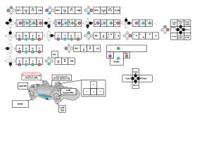

# Dualshock 4 Keyboard
> Use your DS4 gamepad as a keyboard with touchpad while laying on the couch!

This is a proof of concept implementation of virtual keyboard device that
enables you to press any of these keyboard buttons with Dualshock 4 gamepad. It
currently works only on Linux and have non-trivial way to set up and run.

## Installation on Linux

You will need a C compiler (GCC or Clang) and `make` utility. Download and
unpack zip archive of this repo or clone it with git. Then run the following
from the root of the downloaded repo directory:

```
make
```

It will produce a binary named `main`.

## Connect via Bluetooth or USB

You can connect your DS4 gamepad to your PC either with USB cable or Bluetooth wireless connection. USB is just works, skip to the next section if you are gonna use USB. Here is some guidance for getting a Bluetooth connection.

Run `bluetoothctl` from terminal. In `bluetoothctl` console enable scan. I usually do it like this:

```
scan on
```

You may need to enable power on the bluetooth controller, register a default
agent and maybe some other things. Please refer to bluetoothctl documentation
elsewhere (Arch wiki has pretty good article on this though).

Then push "SHARE" and "PS" buttons on the gamepad simultaneously and hold them
for a couple of seconds. The LED light on the controller must start flashing for
short periods with long pauses (around 100ms of light to 1 second of darkness
interval). After this you will see than bluetoothctl found the "Wireless
Controller" device like this:

```
[NEW] Device D0:BC:C1:A2:BE:9F Wireless Controller
```

Go connect to it:

```
[bluetooth]# connect D0:BC:C1:A2:BE:9F
Attempting to connect to D0:BC:C1:A2:BE:9F
Connection successful
[Wireless Controller]# devices
Device D0:BC:C1:A2:BE:9F Wireless Controller
[Wireless Controller]#
```

Perfect! We've got a connection.

## Run

First of all you need to be able to open `/dev/uinput` as a user, unless you
decided to do everything from root. Do this for your `user` as root if you want
to be able to run the virtual keyboard as user:

```
chown user:user /dev/uinput
```

Read the content of a file `/proc/bus/input/events` to another file on the disk or pipe it to some text editor or viewer. For example:

```
cat /proc/bus/input/devices | less
```

Then find there an entry for `"Sony Interactive Entertainment Wireless Controller"`. It will look like this:

```
I: Bus=0003 Vendor=054c Product=09cc Version=8111
N: Name="Sony Interactive Entertainment Wireless Controller"
P: Phys=usb-0000:02:00.0-1.4.2.4/input3
S: Sysfs=/devices/pci0000:00/0000:00:01.2/0000:02:00.0/usb1/1-1/1-1.4/1-1.4.2/1-1.4.2.4/1-1.4.2.4:1.3/0003:054C:09CC.000B/input/input27
U: Uniq=d0:bc:c1:a2:be:9f
H: Handlers=js0 event23
B: PROP=0
B: EV=1b
B: KEY=7fdb000000000000 0 0 0 0
B: ABS=3003f
B: MSC=10
```

If you don't see any entries for "Sony Interactive Entertainment something something..." and you are sure that your USB cable is good or that you are definitely connected to the gamepad via bluetooth, then go mess around with your kernel config and find a way to enable DS4 support.

The line `H: Handlers=js0 event23` is what we need. `event23` is the gamepad event source name that is gonna be intercepted and substituted by the program. You may end up with different number with the word `event`. Anyway you must use the proper file name you've got from your `/proc/bus/input/devices` in the following commands instead of `event23`.

Once again, if you are planning to use virtual keyboard as `user`, you must make sure the `/dev/input/event23` file is accessible by the `user`. Usually `/dev/input/event*` files have group set to `input`, so if you add `user` to the `input` group, you will be fine. Otherwise you may just change the owner of the file to be your `user` like this (run as root):

```
chown user:user /dev/input/event23
```

Then run the program like this:

```
./main /dev/input/event23
```

## Usage 

Now you can issue keyboard keypresses by pressing some combinations of the gamepad buttons as shown in the following chart:



The key press is registered when you let go at least one of the buttons in the combination (chord) you pressed. So you first press the desired chord and then release all the buttons to commit a keypress that corresponds to the chord.

## Meta

Authors:
- Vladimir Novikov – oxore@protonmail.com

This is free and unencumbered software released into the public domain. See
``UNLICENSE`` for more information.

<!-- Markdown link & img dfn's -->
[readme-template]: https://github.com/dbader/readme-template
